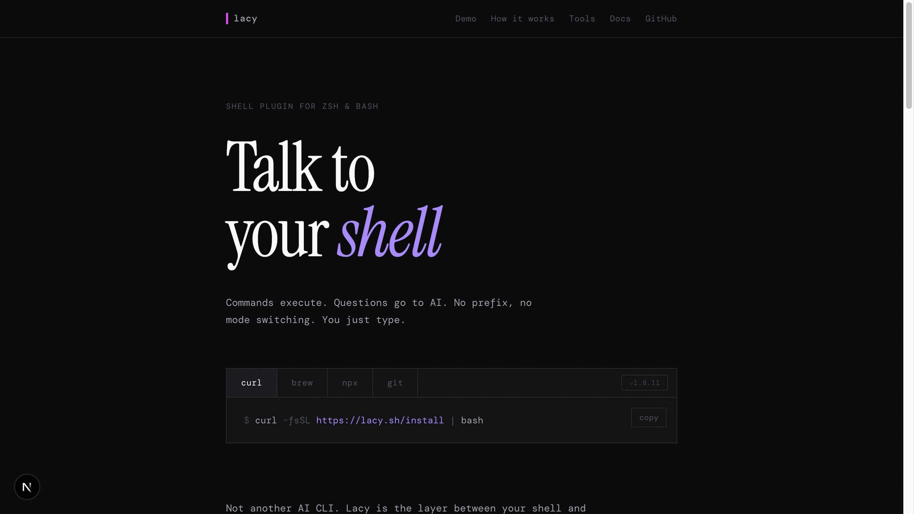
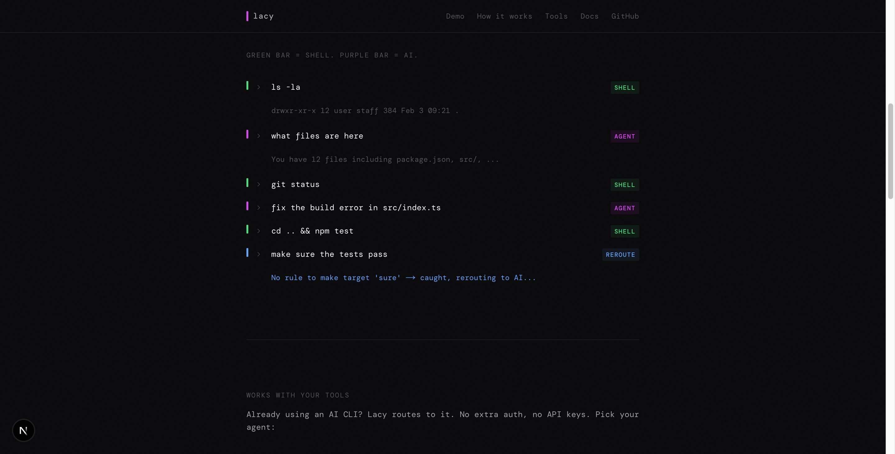
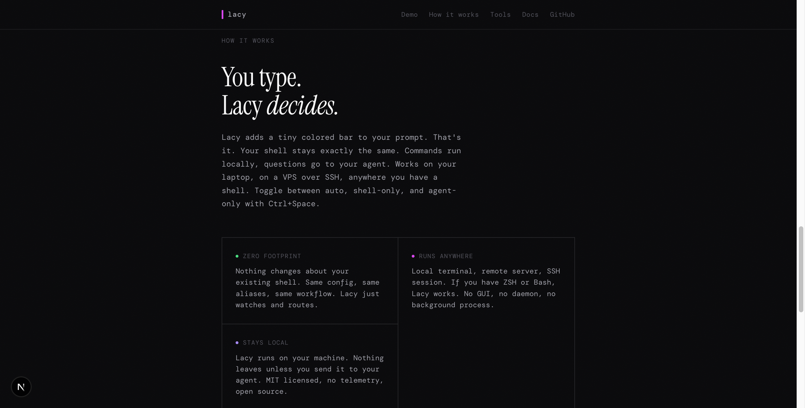
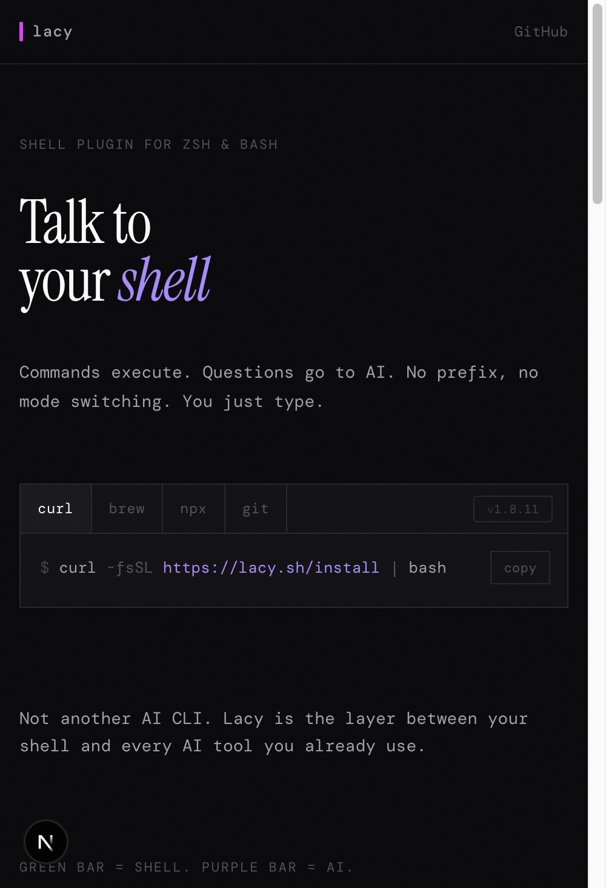

# lacy.sh

Marketing site for [Lacy Shell](https://github.com/lacymorrow/lacy) — a ZSH/Bash plugin that detects natural language vs shell commands and routes input to your AI agent automatically.

[](https://lacy.sh)

## What it does

Commands execute normally. Natural language goes to your AI agent. No prefix, no mode switching. You just type.



Type `ls -la` and your shell runs it. Type `what files are here` and your AI answers. Lacy decides which is which in real time.

## How it works



Lacy adds a tiny colored bar to your prompt. Green means shell. Magenta means agent. Toggle between auto, shell-only, and agent-only with `Ctrl+Space`.

## Mobile



## Development

```bash
npm run dev      # Start dev server (localhost:3000)
npm run build    # Production build
npm run lint     # ESLint
npm start        # Serve production build
```

## Architecture

Single-page Next.js app using the App Router. All content is in `app/page.tsx`. Styling via CSS custom properties in `app/globals.css`.

## Related

- [Lacy Shell](https://github.com/lacymorrow/lacy) — The ZSH/Bash plugin
- [Lash](https://lash.lacy.sh) — AI coding agent CLI (recommended backend)

## License

MIT
